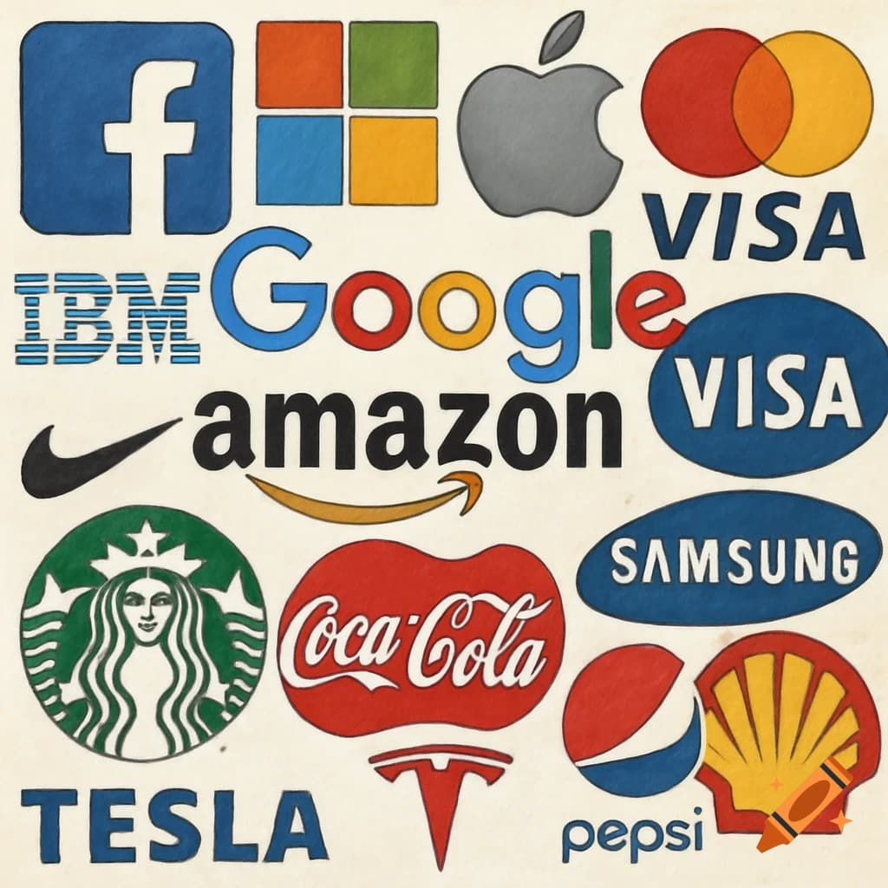
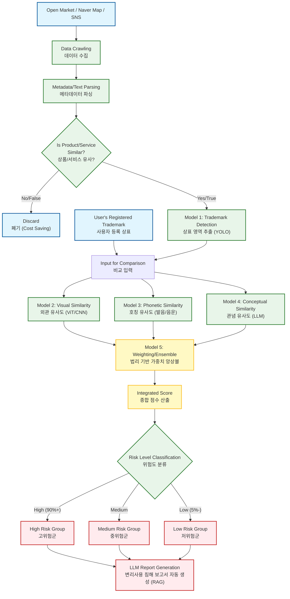

# 상표권 침해 자동 모니터링 및 법리 기반 침해 분석 AI 시스템

<aside>
💡

"온·오프라인에 흩어진 상표 사용 현황을 **자동 수집**하고, AI를 통해 상표 3요소(외관·호칭·관념)를 분석하여 변리사 및 기업 법무팀의 의사결정을 지원하는 **End-to-End 상표 침해 탐지 솔루션**입니다.".

</aside>

<aside>
💡

프로젝트 기간(2026.01.08 ~2026.02.26)

Draft v0.1

기획안 작성자 : 성창훈

</aside>

- 전체 목차 보기/ 접기

# 1. **문제 제기**

## 1.1 상표란?

**상표**는 기업이나 개인이 제공하는 상품·서비스를 다른 경쟁사의 것과 구별하기 위해 사용하는 표시입니다. 스타벅스의 초록색 써이렌 로고, 나이키의 스우시(Swoosh) 마크, 삼성전자의 "SAMSUNG" 텍스트 등이 모두 상표에 해당합니다.

> 출처([https://www.craiyon.com/fr/image/GAkoEWSgRhiQb9eyrt009w](https://www.craiyon.com/fr/image/GAkoEWSgRhiQb9eyrt009w))
> 

상표는 단순한 디자인 요소가 아니라 **법적 권리**입니다. 지식재산처(구 특허청)에 등록하면 해당 상표를 독점적으로 사용할 수 있는 권리(상표권)를 얻습니다. 이 권리를 통해 기업은 자신의 브랜드를 보호하고, 소비자는 제품의 출처를 명확히 알 수 있습니다.
상표의 형태는 다양합니다. 문자(LG, 현대), 도형(애플의 사과, 페라리의 말), 색상(롯데의 빨강, 코카콜라의 빨강과 하양), 심지어 소리(삼성전자의 시작음) 등도 등록 가능합니다. 중요한 것은 **소비자가 상품이나 서비스의 출처를 연상할 수 있는 모든 표시**가 상표가 될 수 있다는 점입니다.

현대 비즈니스에서 상표는 단순한 로고를 넘어 다음과 같은 핵심적인 기능을 수행합니다. 

- **자타상품 식별 기능:** 소비자가 수많은 상품 중 특정 제조사의 제품을 구별할 수 있게 합니다.
- **출처 표시 기능:** 해당 상품이 특정한 주체로부터 생산·판매되었다는 것을 나타냅니다.
- **품질 보증 기능:** 동일한 상표가 부착된 상품은 동일한 수준의 품질을 갖추고 있음을 소비자에게 신뢰하게 합니다.
- **광고 선전 및 경제적 가치:** 브랜드 이미지를 구축하여 기업의 무형 자산(Goodwill)으로서 막대한 경제적 가치를 형성합니다.

## **1.2 상표권 침해의 의미**

상표권 침해는 흔히 "짝퉁 판매"와 혼동되지만, 법적으로는 다릅니다. **짝퉁**은 원본 상품을 모조·복제해 판매하는 것(물건 자체의 위조)이라면, **상표권 침해**는 등록된 상표를 그 권리 범위 밖에서 무단으로 사용하는 행위입니다.

예를 들어봅시다. A라는 회사가 "APEX"라는 이름으로 운동화를 특허청에 등록했습니다. 이제 "APEX"는 A사의 독점권입니다. 만약 B라는 회사가:

- 운동화에 "APEX"를 붙여 판매하면 → **명백한  상표권 침해**
- 운동화 대신 젓갈에 "APEX"를 붙여 판매하면 → 상품이 다르므로 침해 가능성 낮음
- 비슷한 발음의 "APEKS"라는 운동화를 판매하면 → 유사 상표 사용으로  **침해 가능성 높음.**

> 이미지 출처([https://www.donga.com/news/Economy/article/all/20241002/130140975/1](https://www.donga.com/news/Economy/article/all/20241002/130140975/1))
> 

여기서 핵심은 **"출처의 오인·혼동" 염려**입니다. 소비자가 "APEXS" 운동화를 샀는데 "APEK"라고 생각해 구매했다면, B사가 A사의 상표권을 침해한 것입니다.

상표권 침해는 단순히 동일한 상표를 쓰는 경우만이 아닙니다. **등록 상표와 유사한 상표**를 **지정상품 또는 지정서비스와 동일하거나 유사한 상품·서비스**에 사용하는 경우도 포함됩니다. 이는 법률적으로 권리자의 허락 없이 상표의 독점권을 침해하는 행위이며, 실무적으로는 소비자에게 혼동을 야기해 브랜드 가치를 훼손하는 문제로 이어집니다.

결국 상표권 침해는 다른 회사의 상표 혹은 그와 유사한 상표를 그 권리자의 허락 없이 같거나 유사한 상품·서비스에 사용해서 소비자를 혼동시킬 염려가 있는 경우를 말합니다.

## **1.3 상표권 침해 시장의 확대와 문제점**

상표권 침해는 더 이상 틈새시장의 문제가 아닙니다. 지난 수년간 상표 출원이 꾸준히 증가하면서 기업들의 브랜드 보호 필요성도 함께 커지고 있습니다. 특허청에 출원되는 상표 건수만 해도 최근 10년간 연평균 8.0% 성장세를 보이고 있으며, 이는 기업들이 자신의 브랜드를 얼마나 중요하게 생각하는지 반영합니다.

하지만 출원 증가만큼 **침해 사례도 급증**하고 있습니다. 관세청 통계에 따르면 2023년 83,892건에서 2024년 101,344건으로 단 1년 만에 20.8% 증가했습니다. 이는 기업들이 얼마나 빠르게 새로운 침해 위협에 노출되고 있는지 보여주는 지표입니다.

특히 문제가 되는 것은 **침해 채널의 다양화**입니다. 온라인 쇼핑몰, SNS, 오픈마켓 등 상표가 사용되는 채널이 폭증 하면서 모니터링 난이도가 급격히 높아졌습니다. 온라인 위조 상품 차단 건수만 해도 2023년 161,110건에서 2025년 210,032건으로 매년 최고치를 경신하고 있습니다. 이는 단순히 오프라인 간판이나 노점상 수준의 관리로는 더 이상 대응할 수 없다는 뜻입니다.

**인력과 시간 소모 문제도 심각**합니다. 변리사나 기업 법무팀은 이러한 침해 사례들을 일일이 모니터링하고 대응해야 하는데, 채널이 다양해질수록 이 작업은 기하급수적으로 복잡해집니다. 침해 발견이 늦어질수록 브랜드 신뢰도 하락, 매출 손실, 소송 비용 증가 등의 리스크가 누적됩니다. 대형 로펌이나 법무팀을 갖춘 기업도 관리하기 벅찬 상황이 되었습니다.

더욱 우려스러운 것은 **K-브랜드의 글로벌 영향력 확대에 따라 침해 분쟁도 함께 증가**하고 있다는 점 입니다. 한류 열풍과 K-뷰티, K-패션의 국제적 인기로 국내 브랜드들이 전 세계적으로 주목받으면서, 동시에 그 상표를 모방하거나 오도하는 사례도 폭증했습니다. 2023년 4,045건의 상표 침해 분쟁에서 2024년 10,000건 이상으로 2.5배나 증가했으며, 분쟁에 연루된 기업 수도 3,622곳에서 7,447곳으로 2배 이상 늘어났습니다. 이제 상표권 침해는 국내 기업들이 국제 무대에서 마주하는 **필연적 도전**이 되었습니다.

결국 상표권 침해 시장의 확대는 단순한 "불법" 문제를 넘어 **경제 규모의 문제**가 되었습니다. 침해 탐지와 대응에 투입되는 시간, 소송 비용, 브랜드 손상으로 인한 기회 손실까지 고려하면, 기업들이 감당해야 하는 부담은 매년 증가하고 있는 상황입니다.

# **2. 기본 개념 정리**

## **2.1 짝퉁 상품 개념**

"짝퉁"이라는 단어를 들으면 대부분 동대문 노점상이나 온라인에서 저렴하게 판매되는 **가짜 명품 가방**이나 **모조 운동화**를 떠올립니다. 실제로 루이비통 가방을 정교하게 복제한 제품, 나이키 로고를 그대로 붙인 신발, 샤넬 향수병을 똑같이 만든 제품 등이 바로 짝퉁 상품의 대표적인 사례입니다.

> 출처([https://legitgrails.com/blogs/news/how-to-tell-if-a-designer-purse-is-real-vs-fake](https://legitgrails.com/blogs/news/how-to-tell-if-a-designer-purse-is-real-vs-fake))
> 

짝퉁 상품 침해는 **물건 자체를 위조하거나 모조**하는 데 초점이 맞춰져 있습니다. 즉, 원본 제품의 디자인, 로고, 포장까지 최대한 똑같이 만들어 소비자가 진품으로 오인하게 만드는 행위입니다. 이런 짝퉁 제품들은 주로 **유통망 단속**을 통해 적발되며, 관세청이나 경찰 같은 수사기관이 압수·단속하는 대상이 됩니다.

하지만 짝퉁 상품 침해는 "물리적인 제품"에 한정됩니다. 간판에 유사한 상호를 사용하거나, 온라인 광고에서 브랜드를 오도하는 문구를 쓰거나, 서비스업체가 유사한 상표명을 사용하는 경우는 **짝퉁 상품의 범주에 들어가지 않습니다**. 여기서 상표권 침해의 개념이 필요해집니다.

## **2.2 상표권 침해 / 상표 침해의 법적 정의**

상표권은 **특허청에 등록된 상표를 독점적으로 사용할 수 있는 법적 권리**입니다. 상표법 제89조에 따르면 "상표권자는 지정상품에 관하여 그 등록상표를 사용할 권리를 독점한다"고 명시되어 있습니다.

여기서 핵심은 **"지정상품"**이라는 개념입니다. 상표권은 무한정 모든 제품에 적용되는 게 아니라, 출원 당시에 지정한 상품이나 서비스에만 효력이 미칩니다. 예를 들어 "스타벅스"라는 상표를 커피(제30류)와 카페 서비스(제43류)로 등록했다면, 누군가 "스타벅스"라는 이름으로 **커피나 카페를 운영하면 침해**가 성립하지만, 전혀 다른 업종인 **자동차 부품에 "스타벅스"를 쓰면 침해가 아닐 가능성**이 높습니다.

**지정상품/지정서비스**는 국제적으로 통용되는 니스분류(Nice Classification)에 따라 총 45개 류로 나뉩니다. 제1~34류는 상품(의류, 전자제품, 식품 등), 제35~45류는 서비스업(광고, 음식점, 법률 등)입니다. 상표 출원 시에는 이 분류 중에서 자신이 사용할 상품이나 서비스를 구체적으로 선택해야 합니다.

### **2.2.1 상표권 침해의 성립 요건**

상표권 침해가 성립하려면 다음 조건들이 충족되어야 합니다.

1. **유효한 등록상표권이 존재**할 것
2. 침해자가 표장을 상표로서 사용했을것
3. **등록상표와 동일하거나 유사한 상표**를 사용할 것
4. **지정상품/서비스와 동일하거나 유사한 상품/서비스**에 사용할 것
5. 침해자가 **정당한 권한 없이** 상표를 사용할 것
6. 효력 제한 범위 밖에서 사용했을것.
7. 이로 인해 **소비자에게 출처의 오인·혼동**을 일으킬 우려가 있을 것

여기서 3번 요건인 "유사한 상표"를 판단하는 기준이 바로 **외관·호칭·관념**입니다.

## **2.3 현재 존재하는 AI 솔루션 개관**

그럼 다음으로 현존하는 상표 보호에 관한 AI 서비스들을 살펴보겠습니다.

### **2.3.1 출원 전·출원 단계: 유사상표 검색 및 추천 AI**

주로 상표를 등록하기 전, 기존에 등록된 상표와 얼마나 유사한지 분석하여 등록 거절 리스크를 줄이는 데 초점을 맞춥니다.

- **키프리스 (KIPRIS - 지식재산처(구 특허청))**
    - **개요:** 지식재산처가 운영하는 대국민 무료 검색 서비스.
    - **특징:** 1억 3천만 건 이상의 국내외 산업재산권 정보 제공. 최근 AI 기반 이미지 검색 기능을 도입하여 도형 상표 검색 편의성 강화.
    - **한계:** 출원 및 심사 단계의 데이터 조회에 특화되어 있어, 등록 후 시장에서의 침해 모니터링 기능은 제공하지 않음.
- **마크뷰 (MarkView - 마크클라우드)**
    - **개요:** AI 기반 상표 등록 가능성 진단 및 검색 서비스.
    - **특징:** 상표 이미지를 분할 분석하여 부분적 유사성(요부)을 탐지하는 기술 보유. 특허청 의견제출통지서 데이터를 학습해 거절 가능성 예측.
- **마크웍스 (Markworks) / 마크나우 (MarkNow)**
    - **개요:** 변리사 업무 효율화 및 일반인 대상 간편 출원 서비스.
    - **특징:** 유사군 코드 기반 지정상품 추천, 자동 보고서 생성 등 **'출원 업무 프로세스'** 최적화에 집중.

### **2.3.2 등록 후 단계: 짝퉁 상품 탐지 및 브랜드 보호 솔루션**

이미 시장에 유통되고 있는 '위조 상품(물리적 제품)'을 찾아내어 차단하는 데 집중합니다.

- **마크비전 (MarqVision)**
    - **개요:** 글로벌 이커머스 및 SNS 등에서 가품을 탐지하고 제재하는 B2B SaaS 솔루션.
    - **핵심 기능:**
        - **멀티 채널 감시:** 아마존, 쿠팡, 알리바바 등 국내외 1,500개 마켓플레이스 연동.
        - **자동화 대응:** AI가 가품 의심 상품을 탐지하면 봇이 신고 및 삭제 요청(Bot-powered Takedown) 수행.
    - **주요 타깃:** 물리적 형태가 뚜렷한 패션, 뷰티, 명품 브랜드의 **'위조 상품(Counterfeit)'** 적발.

## **2.4 짝퉁 상품 침해 vs 상표권 침해**

일반적으로 '짝퉁'과 '상표권 침해'는 같은 의미로 혼용되는 경우가 많지만, 법률적·재산적 관점에서 보면 명확한 차이가 있습니다. 이 차이를 이해하는 것이 본 프로젝트가 해결하고자 하는 문제의 본질을 파악하는 데 필수적입니다.

### 2.4.1 개념 및 대상의 차이

| **구분** | **짝퉁 상품 침해 (Counterfeit)** | **상표권 침해 (Trademark Infringement)** |
| --- | --- | --- |
| **핵심 개념** | **물건 자체의 위조·모조** | **등록 상표의 무단 사용** |
| **침해 대상** | 유형의 제품 (가방, 신발, 의류 등) | 제품 + **서비스업, 간판, 광고, 도메인 등** |
| **주요 쟁점** | 원본 제품과 얼마나 똑같이 만들었는가? (물리적 유사성) | 소비자가 **출처를 오인·혼동**할 우려가 있는가? (관념적 유사성 포함) |
| **대응 방식** | 유통망 단속, 통관 보류, 압수 폐기 | 민사 소송(손해배상), 형사 고소, 경고장 발송 |

### **2.4.2 법률적 효력과 상표권 침해에서 대점**

단순 짝퉁 단속을 넘어 '상표권'으로 대응할 때 권리자는 강력한 법적 보호를 받습니다.

**1. 입증 책임의 전환 및 완화**

- **일반 불법행위(부정경쟁방지법 등):** 권리자가 손해 발생 사실, 액수, 상대방의 고의·과실을 모두 입증해야 함.
- **상표권 침해:**
    - **과실 추정:** 등록된 상표를 침해한 자는 과실이 있는 것으로 추정함 (상표법 제112조). 침해자가 '몰랐음'을 입증해야 면책 가능.
    - **손해액 추정:** 침해자가 얻은 이익이나, 피해자(권리자)가 입은 피해액을 손해액으로 인정받기 용이함.

**2. 손해배상 산정의 편의성 (상표법 제110조)**

- **침해자 이익액 추정:** 침해자가 판매하여 얻은 이익을 권리자의 손해로 봄.
- **법정 손해배상:** 구체적인 손해액 입증이 어려워도, 법원이 재량으로 상당한 금액(최대 1억 원, 고의적 침해 시 3억 원)을 배상액으로 인정 가능.
- **고의 침해의 경우 :** 고의적 침해의 경우, 최대 5배 이내에서 징벌적 손해배상을 청구할 수 있음.

**3. 형사적 구제의 용이성**

- 상표권 침해죄(7년 이하 징역 또는 1억 원 이하 벌금)가 적용되어, 수사기관을 통한 형사 고소가 가능하므로 침해자에게 강력한 심리적 압박과 억제력을 가질 수 있음.

**4. 소결**

- 이처럼 상표권 침해를 밝힌느 것은 단순 짝퉁 상품 임을 밝혀내는 것과 다른 가치를 가지고 있습니다.

# 3. **해결해야 하는 과제 및 시스템 타깃**

## **3.1 기존 서비스의 미해결 과제**

앞서 2.3에서 살펴본 기존 AI 솔루션들은 **출원 단계의 편의성**’이나 **물리적 위조 상품(짝퉁) 적발**에만 집중되어 있어, 실제 법률 현장에서 요구하는 **「상표권 침해 법리」**를 충족하지 못하는 한계가 존재합니다.

### **① "등록 이후"의 사후 관리 공백**

- **현황:** 키프리스, 마크뷰, 마크웍스 등 대다수 솔루션은 **출원 전 검색**과 **등록 가능성 판단**에 특화되어 있습니다.
- **문제점:** 상표권은 등록된 이후부터가 진짜 권리 행사의 시작입니다. 그러나 현재 시스템들은 등록 완료 후 **시장에서 내 상표가 어떻게 무단 도용되고 있는지**를 지속적으로 추적하는 기능이 부재합니다. 기업 법무팀은 등록증을 받은 후, 다시 수동 검색으로 돌아가야 하는 실정입니다.

### **② 짝퉁(Goods) 중심 탐지로 인한 '서비스업 침해' 사각지대**

- **현황:** 마크비전 등 브랜드 보호 솔루션은 가방, 신발 등 **'유형의 상품(Goods)'** 이미지를 인식하여 디자인 도용을 잡아내는 데 탁월합니다.
- **문제점:** 현대 비즈니스에서 상표 침해는 상품에만 국한되지 않습니다.
    - **간판/상호:** 식당, 카페, 병원 등 오프라인 매장의 간판
    - **온라인/광고:** 포털 사이트의 키워드 광고, 블로그 홍보 문구, 도메인 이름
    - 위와 같은 **비물리적(서비스업) 침해**나 **텍스트 기반 침해**는 기존의 이미지 중심 짝퉁 탐지 AI로는 포착이 불가능합니다.

### **③ '외관'에만 치중된 반쪽짜리 분석 (법리 부재)**

- **현황:** 기존 AI는 주로 이미지 매칭(Computer Vision) 기술에 의존하므로, 눈에 보이는 **외관(Appearance)**의 유사성만 판단합니다.
- **문제점:** 한국 상표법 및 대법원 판례는 상표의 유사 여부를 **외관, 호칭(발음), 관념(의미)** 3가지 요소를 종합하여 판단합니다.
    - **호칭 침해 놓침:** 'HITE'와 'HIGHT'는 모양은 다르지만 발음이 같아 침해입니다.
    - **관념 침해 놓침:** '설화'와 '한설화'는 글자가 다르지만 의미가 같아 침해입니다.
    - 기존 AI는 이러한 **호칭·관념의 유사성**을 전혀 계산하지 못하므로, 실제 법적 분쟁 위험을 예측하는 데 한계가 큽니다.

### **④ 법률적 판단 로직(요부 관찰 등)의 미반영**

- 단순히 두 이미지가 얼마나 겹치는지(IoU)를 보는 것만으로는 부족합니다. 법원은 상표 전체 중 **식별력이 강한 부분(요부)**을 중심으로 관찰하거나, 상황에 따라 전체를 보기도(전체 관찰) 합니다. 이러한 **가중치 판단 로직**이 없는 AI는 법률 전문가의 눈높이를 맞출 수 없습니다.

## **3.2 제안 시스템이 해결하려는 부분**

본 프로젝트는 단순한 '유사 이미지 찾기'를 넘어, 단순 이미지 검색을 넘어, **실제 상표 분쟁에서 통용되는 법리적 판단 기준을 학습한 AI 모델**을 구축하는 것을 목표로 합니다.

<aside>
💡

**핵심 해결 전략:**
단일 모델이 아닌 **'외관·호칭·관념' 3단계 멀티 모달 분석**과 '**법리 기반 가중치 앙상블**'을 통해 침해 판단의 정확도를 법률 전문가 수준으로 끌어올립니다.

</aside>

### **① 온·오프라인 전방위 '사용 상표' 자동 수집**

- **대상 확장:** 쇼핑몰 상품 이미지뿐만 아니라, **포털 지도(간판), SNS 해시태그, 온라인 광고 문구**까지 상표 수집 범위를 확장합니다.

### **② 상표법상 3요소(외관·호칭·관념) 정밀 분석**

법리적 공백을 메우기 위해 3가지 독립된 AI 모델을 결합합니다.

- **외관(Appearance):** 시각적 디자인과 로고의 형상 유사도 분석 (Vision AI)
- **호칭(Pronunciation):** 한글/영문 음운 분석을 통해 청각적 발음 유사도 분석 (Phonetic Algorithm)
- **관념(Meaning):** 단어가 가진 의미적 유사성 분석 (LLM/Semantic Search)

### **③ '요부 관찰' 법리를 반영한 가중치 앙상블**

- 모든 부분을 똑같이 보는 것이 아니라, 상표에서 **식별력이 높은 핵심 부분(요부)**에 더 높은 가중치를 부여하는 알고리즘을 적용합니다.
- 이를 통해 기계적인 유사도가 아니라, **"일반 수요자가 직관적으로 출처를 혼동할 우려가 있는가"**라는 상표법의 대원칙에 부합하는 결과를 도출합니다.

### **④ End-to-End 법률 리포트 제공**

- 단순히 "비슷하다"는 알림을 주는 것을 넘어, **"왜 침해로 판단했는지"**에 대한 근거(관련 판례, 유사도 점수, 법적 근거)가 포함된 리포트를 생성하여 변리사와 법무팀의 의사결정을 지원합니다.

## **3.3 시스템 타깃 대상**

본 시스템은 상표권의 법리적 분석이 필요한 **전문가 그룹(B2B)**과 대규모 상표 관리가 필요한 **공공기관(B2G)**을 핵심 타깃으로 합니다.

### **① B2B: 법률 전문가 및 기업 법무팀**

가장 즉각적인 수요가 발생하는 시장으로, 업무 효율화와 리스크 관리가 핵심 가치입니다.

- **1차 타깃: 특허법인 및 변리사 사무소 (IP Law Firms)**
    - **Needs:** 수천 건의 고객 상표를 관리해야 하지만, 인력 한계로 등록 후 모니터링 서비스를 제공하기 어려움.
    - **Use Case:** 고객사에게 **"AI 기반 24시간 상표 침해 모니터링 서비스"**를 부가 상품으로 제공하여 추가 수익 창출 및 고객 Lock-in 효과 기대.
    - **Benefit:** 침해 의심 사례 발견 시, AI가 작성한 초안 보고서를 바탕으로 빠르게 경고장 발송 및 소송 영업으로 연계 가능.
- **2차 타깃: 기업 법무팀 및 브랜드 관리팀 (In-house Counsel)**
    - **Needs:** 자사 브랜드(상표)가 온·오프라인에서 무단 도용되는 것을 막고, 브랜드 가치 희석을 방지해야 함.
    - **Use Case:** 사내 IP 관리 시스템에 연동하여 자사 상표에 대한 침해 현황을 대시보드로 상시 확인.
    - **Benefit:** '짝퉁'뿐만 아니라 **유사 상호, 비방 광고** 등 광범위한 침해에 대해 선제적 대응(Risk Management) 가능.

### **② B2G: 정부 기관 및 공공 부문**

국가 차원의 지식재산 보호 및 데이터 확보를 목표로 합니다.

- **지식재산 주무 부처 (지식재산처(구 특허청) 및 산하 공공기관)**
    - **Needs:** 급증하는 상표 출원 및 분쟁에 대비한 심사 업무 효율화와 침해 실태 파악.
    - **Use Case:**
        - **심사관 보조:** 상표 심사 시, 기 등록된 상표와의 외관·호칭·관념 유사도 정밀 분석 참고 자료로 활용.
        - **정책 데이터 확보:** 국내 상표 침해가 빈번하게 발생하는 업종, 지역, 유형(온라인/오프라인)에 대한 거시적 통계 데이터 추출.
    - **Benefit:** 인공지능을 활용한 행정 효율화 및 K-브랜드 보호 정책 수립을 위한 데이터 근거 마련.

# **4. 시스템 아키텍처**

- [ ]  이 챕터는 노션에서 **섹션을 쪼개거나 토글 블록**으로 나눠서,“법리 개념 → 데이터 수집 → 각 모델 → 앙상블 → 보고서 생성” 흐름을 보여주면 좋음.

## **4.1 침해 상표 판단 법리 (특히 유사 상표 판단의 법리에 관해서)**

시스템 아키텍처에 대해 이해하기 위해, 상표법에서 상표 침해에 대한 판단 법리를 먼저 살펴보겠습니다. 

앞서 설명하였듯 등록 상표와 동일 유사한 상표를 등록상표의 지정상품(혹은 서비스)과 동일 유사한 상품(혹은 서비스)에 사용하는 경우 침해가 성립할 수 있습니다. 이 중 유사한 상표를 판단 하는 방법에 대해 살펴보겠습니다.

### 4.1.1 상표의 유사판단 법리

대법원 판례에 따르면 양 상표가 유사한지 여부는 양 상표의 외관, 호칭, 관념을 전체적 객관적 이격적으로 관찰하여, 해당 상표의 일반수요자등의 입장에서 출처의 오인 혼동 여부가 있는지 따라 판단합니다. 즉, 양 상표의 **외관, 호칭, 관념**이 상표의 유사 판단에서 3요소가 됩니다. 아래에서는 외관, 호칭, 관념의 의미에 대해 살펴보겠습니다.

### **4.1.2 외관·호칭·관념: 상표 유사 판단의 3요소**

실무에서 두 상표가 유사한지 판단할 때는 세 가지 요소를 종합적으로 봅니다.

**1. 외관(外觀, Appearance)**

상표의 **시각적 형태**를 말합니다. 문자의 모양, 도형의 구성, 색채, 전체적인 디자인 등이 얼마나 비슷한지 판단합니다.

- **예시**: **'아디다스(Adidas)'의 3선 스트라이프**와 **'2선 또는 4선 스트라이프'**.
일반 소비자가 매장에서 얼핏 보았을 때, 줄무늬의 개수를 세어보지 않고 전체적인 사선의 배치나 모양만 보고 아디다스 제품으로 오인할 수 있다면 외관이 유사한 것으로 봅니다. 또한 **'스타벅스'의 녹색 원형 로고**와 유사한 배색 및 구도를 가진 타사의 커피 로고 역시 문자 내용은 다르더라도 외관상 유사하다고 판단될 수 있습니다.

.jpg)

> 생성형 이미지(나노 바나나)
> 
- 단, 단순히 글자 하나하나를 비교하는 게 아니라 **전체적인 인상**을 봅니다. 멀리서 봤을 때, 또는 기억 속에서 떠올릴 때 비슷하게 느껴지면 외관이 유사한 것입니다.

**2. 호칭(呼稱, Pronunciation)**

상표를 **소리 내어 읽었을 때의 발음**입니다. 문자가 달라도 발음이 같거나 비슷하면 호칭이 유사하다고 봅니다.

- **예시**: 
맥주 상표 **'HITE(하이트)'**와 **'HIGHT(하이트)'**.
두 상표는 철자(Spelling)와 뜻은 다르지만, 한국 소비자가 발음할 때 "하이트"로 동일하게 소리 나므로 호칭이 유사합니다. 또한**'NATURE REPUBLIC(네이처 리퍼블릭)'**과 **'NATURE PUBLIC(네이처 퍼블릭)'**처럼 음절 수가 다소 다르더라도 전체적인 억양과 어감이 비슷하여 혼동을 줄 수 있다면 유사 상표로 봅니다.

> 생성형 이미지(나노 바나나)
> 
- 외국어 상표의 경우, 원어민 발음이 아니라 **한국 소비자가 자연스럽게 읽는 발음**을 기준으로 합니다. 예를 들어 "falchi"와 "뽈찌"는 한국인이 유사하게 발음할 가능성이 높아 호칭 유사로 판단될 수 있습니다.

**3. 관념(觀念, Meaning)**

상표가 주는 **의미나 이미지**입니다. 단어의 뜻, 연상되는 개념 등이 유사한지 봅니다.

- **예시**: 
한국 화장품 업계에서 유명한 **설화(雪花) vs 한설화(韓雪花) 사건**이 좋은 사례입니다. 아모레퍼시픽은 2006년 "설화"를 상표로 등록해 화장품을 판매했습니다. 그런데 2007년 서아통상이 "한설화"라는 상표를 등록하고 역시 화장품 사업을 시작했습니다. 
처음에는 특허심판원과 특허법원이 두 상표를 "비유사"라고 판단했습니다. 이유는 **외관과 호칭**이 다르기 때문이었습니다. "설화"와 "한설화"는 글자체도 다르고, 발음도 '설화' vs '한설화'로 다르니까요.
하지만 **대법원은 다르게 판단했습니다**. 대법원은 "두 상표 모두 '**한국의 눈꽃(한국의 설화)**'이라는 의미를 연상할 수 있어, **관념적으로 유사하다**"고 선언했습니다. 한자로 보면 설화(雪=눈, 花=꽃)와 한설화(韓=한국, 雪=눈, 花=꽃)는 결국 같은 의미를 담고 있다는 것입니다.
결과적으로 외관·호칭은 달랐지만 **관념의 유사성만으로 상표 침해가 인정**되었습니다.

> 생성형 이미지(나노 바나나)
> 

### **4.1.3 종합적·객관적·이격적 관찰(참고)**

법원은 외관, 호칭, 관념 세 요소를 **전체적으로, 객관적으로, 떨어뜨려 놓고(이격적)** 판단합니다.

- **전체적**: 상표의 일부분만 보는 게 아니라 전체 인상을 봅니다.
- **객관적**: 상표권자의 주관이 아니라 일반 소비자 기준입니다.
- **이격적**: 두 상표를 나란히 놓고 비교하는 게 아니라, 시간과 공간을 두고 기억 속에서 혼동될지를 봅니다.

일반적으로 **세 요소 중 하나만 유사해도** 상표가 유사하다고 판단될 수 있습니다. 하지만 절대적인 규칙은 아니며, 어느 한 요소가 유사하더라도 다른 점들을 종합했을 때 출처 혼동이 없다면 비유사로 볼 수도 있습니다.

### **4.1.4 출처의 오인·혼동**

결국 상표권 침해 판단의 핵심은 **"소비자가 상품의 출처를 혼동할 우려가 있는가"**입니다.

예를 들어, A사가 "프레시 주스"라는 상표로 음료(제32류)를 등록했는데, B사가 비슷한 디자인의 "프래쉬 쥬스"로 음료를 판매한다면, 소비자는 "둘이 같은 회사 제품인가?" 하고 헷갈릴 수 있습니다. 이런 경우 상표권 침해가 성립합니다.

- 상표법상 유사판단의 기본 구조
    - 외관·호칭·관념을 **전체적·객관적·이격적으로 관찰**
    - 해당 상표가 사용되는 상품/서비스를 기준으로, **수요자의 직관적 인식**을 중시
    - 출처의 오인·혼동 염려가 있는지 여부
- 나중에 **요부 관찰 법리**와 연결될 부분을 간단히 예고

## **4.2 전체 시스템 아키텍처 개괄**

## **4.3 사용상표 수집 및 상품유사군 필터링**

### **4.3.1 상표권 침해에서 상품의 동일·유사 개념**

상표권 침해를 판단할 때, 상표의 이름(표장)이 같다고 해서 무조건 침해가 성립하는 것은 아닙니다. **상표가 사용된 '상품'이나 '서비스'의 카테고리도 서로 겹쳐야만** 법적인 침해로 인정됩니다.(앞서 상표권 침해의 성립 요건 4번)

**1. "이름이 같아도 파는 물건이 다르면 침해가 아니다"**

- 상표권은 등록 당시 지정한 상품(지정상품)에 대해서만 독점적인 권리를 가집니다.
- **예시:** 만약 '스타벅스'가 커피(제30류)에만 상표를 등록했다면, 타인이 전혀 다른 업종인 '자동차 타이어'에 '스타벅스'라는 이름을 붙여 팔더라도 소비자가 혼동할 가능성이 낮아 상표권 침해로 보지 않습니다.
- 즉, **상표의 유사성**뿐만 아니라 **상품의 유사성**까지 동시에 충족되어야 침해가 성립합니다.

**2. 특허청 '상품유사군 코드' 기반의 필터링 필요성**

- 특허청은 거래 실정이 비슷하여 서로 경쟁 관계에 있는 상품들을 묶어 **'유사군 코드(Similarity Code)'**라는 분류 체계로 관리합니다. (예: G01B01)
- 판례에 따르면 상품류 구분이나 유사군 코드가 유사한 상품을 말하는 것은 아니다라고 합니다. 다만, mvp 단계에서는 이런 상품류 혹은 유사군 코드를 활용하고자 합니다.
- 우리 시스템은 단순히 키워드가 일치하는 모든 데이터를 수집하는 비효율을 막기 위해 이 코드를 활용합니다.
- **수집 전략:** "등록된 상표의 유사군 코드와 **동일하거나 유사한 카테고리**에서 사용된 사례인가?"를 1차적으로 필터링하여, 법적으로 **유의미한 침해 후보군만 AI 모델에 전달**합니다. 이는 시스템의 리소스 낭비를 줄이고 분석의 정확도를 높이는 핵심 전처리 과정입니다.

### **4.3.2 수집 단계 아키텍처**

- 크롤링 대상(온라인 쇼핑몰, 오픈마켓, 자사몰, SNS, 포털 지도/리뷰 등) 설계
- 수집 파이프라인(스케줄링, 크롤러, 파싱, 임시 저장 등)을 상위 레벨에서 설명

### **4.3.3 수집 데이터 항목**

- 사용 상표(이미지/텍스트)
- 사용 상품 또는 서비스의 명칭
- 접근 URL
- 사업자명, 연락처 등(가능하다면)
- 추후 **증거수집/소송/경고장 발송**에 활용 가능한 정보까지 염두

### **4.3.4 수집 상표 저장 DB 설계(초기 아이디어)**

- 저장 여부, 저장 시 구조 설계 고민
    - 모델1(객체 탐지) 이후의 결과를 저장할지 여부
    - 상품류/서비스업 분류 기준으로 테이블 설계할지
- 이 부분은 “현재 고민 중인 아키텍처 옵션” 형태로 정리해도 좋음

## **4.4 상표 객체 탐지 모델 (모델 1)**

### **4.4.1 역할**

- 수집된 이미지(간판, 상품 사진 등)에서 **상표에 해당하는 부분만 탐지/크롭**
- 이후 외관 유사 모델이 **불필요한 배경에 영향을 받지 않도록 전처리**

### **4.4.2 데이터셋 선택**

- AI 허브의 **IP산업의 상표권 보호를 위한 오프라인 상표 이미지 데이터**, 유사상표 관련 데이터셋 등 후보

> [https://www.aihub.or.kr/aihubdata/data/view.do?currMenu=115&topMenu=100&searchKeyword=지식재산&aihubDataSe=data&dataSetSn=71298](https://www.aihub.or.kr/aihubdata/data/view.do?currMenu=115&topMenu=100&searchKeyword=%EC%A7%80%EC%8B%9D%EC%9E%AC%EC%82%B0&aihubDataSe=data&dataSetSn=71298)
> 
- 해당 데이터셋을 선택한 이유(도메인 적합성 등)

### **4.4.3 모델 구조**

- YOLOv11 기반 객체 탐지 모델
- 핵심적인 하이퍼파라미터나 설정등은 간단히만.

### **4.4.4 테스트 및 개선 사항**

- 1차 테스트 결과 요약(정량 지표 + 샘플 스크린샷 정도)
- 현재 보이는 한계, 추가 개선 계획

## **4.5 상표 외관 유사 판단 모델 (모델 2)**

### **4.5.1 데이터셋 및 모델 선정**

- AI 허브 **유사 상표 이미지 검색 서비스의 사용자 입력 이미지 데이터** 등

> [https://www.aihub.or.kr/aihubdata/data/view.do?pageIndex=1&currMenu=115&topMenu=100&srchOptnCnd=OPTNCND001&searchKeyword=유사상표&srchDetailCnd=DETAILCND001&srchOrder=ORDER001&srchPagePer=20&aihubDataSe=data&dataSetSn=71764](https://www.aihub.or.kr/aihubdata/data/view.do?pageIndex=1&currMenu=115&topMenu=100&srchOptnCnd=OPTNCND001&searchKeyword=%EC%9C%A0%EC%82%AC%EC%83%81%ED%91%9C&srchDetailCnd=DETAILCND001&srchOrder=ORDER001&srchPagePer=20&aihubDataSe=data&dataSetSn=71764)
> 
- 어떤 형태의 **이미지 임베딩/시각 유사도 모델**을 사용할지, 선정 이유(예 yolo v11 등)

### **4.5.2 테스트 및 개선**

- 유사/비유사 쌍에 대한 정확도, 리콜 등
- “실제 변리사의 느낌과의 차이” 같은 질적 평가도 간단히 적어도 좋음

## **4.6 상표 호칭 유사 판단 모델 (모델 3)**

### **4.6.1 모델/알고리즘 후보**

- AI 기반(한글 발음/음절 단위 임베딩) vs 전통적 유사도 라이브러리
    - 예: 편집거리, 자모 분해 기반 유사도 등
- 아직 **정확한 알고리즘/라이브러리 선정 전**이라는 점, 앞으로의 연구 방향 정리
- 필요하다면 문자상표·음성 유사 판단의 법리 개념도 여기에 짧게 추가

### **4.6.2 테스트 및 개선**

- 간단한 내부 테스트 계획 또는 향후 계획 수준으로 작성

## **4.7 상표 관념 유사 판단 모델 (모델 4)**

### **4.7.1 모델/아키텍처 후보**

- LLM 기반 의미 유사도, 문장 임베딩, 벡터 DB 활용 여부 등
- 관념 유사 판단에서 **어떤 법리적 포인트(예: 의미/이미지 연상)**를 모델에 반영할지 고민 중인 사항 정리

### **4.7.2 테스트 및 개선**

- 예시 케이스(뜻은 비슷하지만 외관·호칭이 다른 경우 등)를 통해 평가 계획

## **4.8 가중치 앙상블 모델 (모델 5)**

### **4.8.1 요부 관찰 법리 요약**

- 상표 전체 중 **식별력이 강한 부분(요부)**을 더 중시하는 법리
- 전체관찰과 분리관찰의 관계를 짧게 설명

### **4.8.2 법리를 모델에 녹이는 방식**

- 외관/호칭/관념 점수에 **가중치를 주는 구조**
- 어떤 법리 요소를 가져오고, **MVP 단계에서 무엇을 포기했는지** 명시
    - 예: 복잡한 복합상표 구조 중 일부 간략화 등

### **4.8.3 앙상블 구조 설명**

- 모델1~4의 출력을 어떻게 결합하는지
    - 예: 점수 합산, 규칙 기반 보정, 임계값 설정 등

### **4.8.4 테스트 및 개선**

- **단일 모델 vs 앙상블** 성능 비교
- 실제 사례 적용 시의 체감 차이 정리

## **4.9 전체 모델 성능 평가**

- 데이터셋 기반 정량 평가(정확도, 재현율 등)
- **법률 전문가(변리사) 평가와의 정합성**이 어느 정도인지
- 한계점도 같이 명시

## **4.10 침해 상표 보고서 작성 단계**

### **4.10.1 시스템 구조 (RAG + LLM)**

- 상표 침해 여부 판단 결과를 바탕으로,
    - 판례/심사기준/법조문 등을 참조하여
    - **설명 가능한 보고서 형태로 정리해 주는 단계**

### **4.10.2 RAG 설계 이슈**

- 어떤 자료(판례, 심사기준, 심판례 등)를 어디까지 넣을지
- 전처리/청킹 전략(상표 요소별, 쟁점별로 나눌지 등)
- 아직 연구/설계 중인 부분을 솔직하게 정리

### **4.10.3 LLM 선정 및 이유**

- 어떤 모델을 쓸지(오픈소스 vs 상용 등)
- 법률 텍스트 처리 강점, 한국어 성능, 비용, 프라이버시 등의 고려 요소

# **5. 최종 결과물**

- 실제 등록 상표 몇 개를 입력해 **며칠간 자동 모니터링 실행**
- 그 결과 탐지된 침해 의심 상표 사례 정리
    - 스크린샷, 보고서 예시
- 또는, 미리 수집해둔 데이터로 **시뮬레이션 테스트**를 진행한 경우 그 결과

# **6. 변리사 피드백**

- 변리사에게 받은 **정성적 피드백** 정리
    - 어떤 점이 실무에 유용한지
    - 어떤 부분은 아직 신뢰하기 어렵다고 보는지
- 피드백을 통해 **다음 개선 방향**으로 연결

# 7. 자체 평가, 아쉬운 점 및 추후 개선 사항

- 현재 MVP의 한계
    - 데이터 부족, 특정 업종 편향, 법리 반영의 단순화 등
- 기술적·법률적 관점에서의 **추가 연구 필요 포인트**
- 상용화/서비스 단계까지 가려면 필요한 과제들

# **8. 이 프로젝트가 도움이 될 지점 (이점 정리)**

- 변리사/법무팀 입장에서의 **업무 효율화 포인트**
    - 일일 모니터링 시간 절감, 리스크 선제 대응 등
- 기업 입장에서의 **브랜드 보호/리스크 관리**
- 정부/공공기관 입장에서의 **정책 수립을 위한 데이터 인사이트**
- 기존 “짝퉁 탐지 AI”와 차별되는 **법리 기반 상표권 침해 모니터링**이라는 포인트 강조

# **9. 결론**

- 프로젝트를 통해 **무엇을 검증했는지**(기술적 가능성, 실무 적용 가능성 등)
- 앞으로의 확장 가능성(다른 IP 권리, 해외 상표 데이터, 멀티모달 확장 등)
- 상표권 보호 생태계 전반에서의 의미를 한 문단 정도로 정리