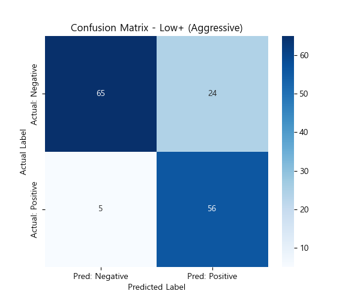
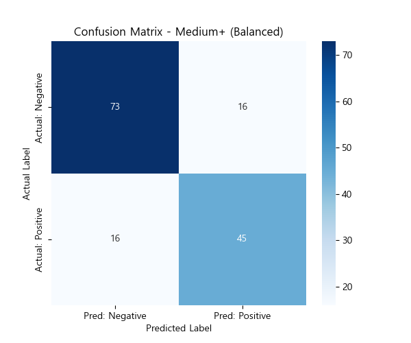
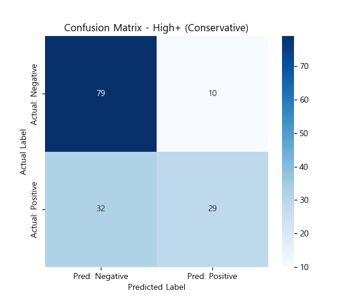
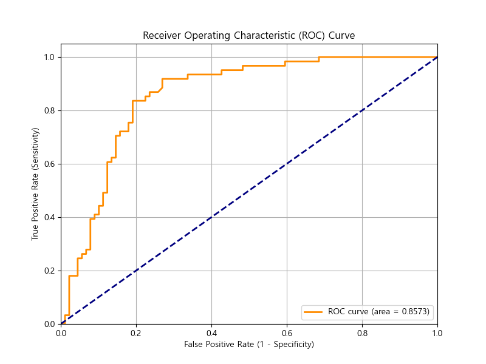
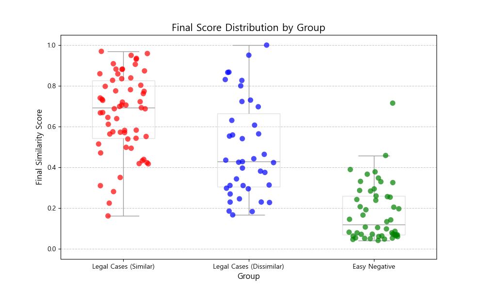
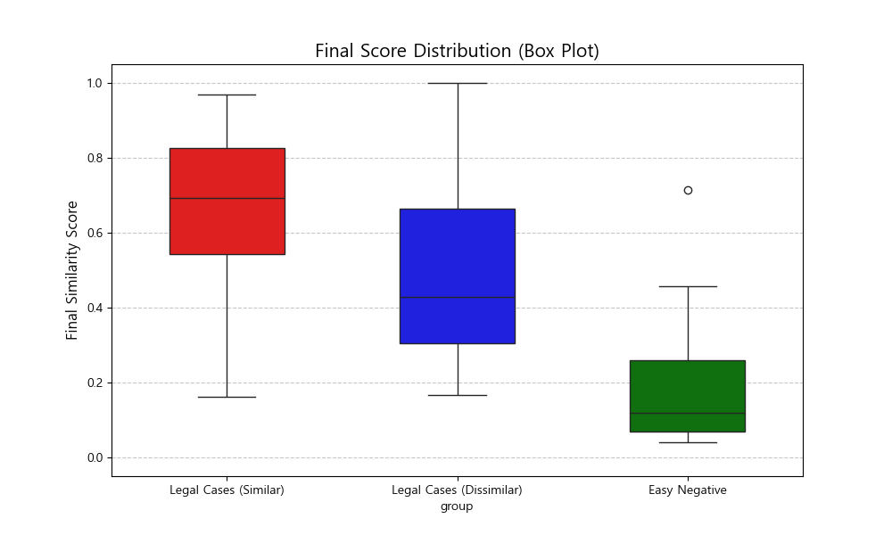
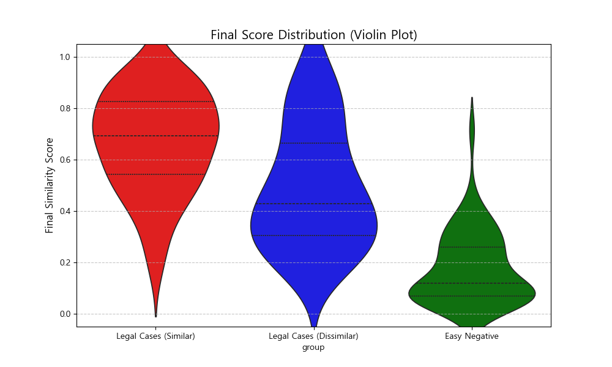
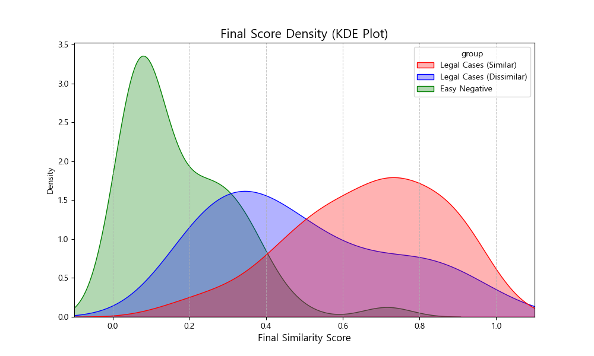

# 모델 5 성능 분석 보고서 (초기 테스트 - 튜닝 후)

## 1. 개요
*   **분석 대상 데이터**: `baseline_result_test_final_real_version.csv`
*   **분석 목적**: 유사 상표 탐지를 위한 위험도(Risk Level) 임계값(Threshold) 설정의 최적화
*   **평가 방법**: 세 가지 임계값 시나리오(Low+, Medium+, High+)에 대한 성능 지표 비교

## 2. 임계값 시나리오 정의

| 시나리오 | 설명 | 유사 판단 기준 (Positive Class) |
| :--- | :--- | :--- |
| **Low+ (공격적)** | 가장 넓은 범위의 위험도를 유사로 판단 | Risk Level이 **Low, Medium, High**인 경우 |
| **Medium+ (균형)** | 중간 이상의 위험도만 유사로 판단 | Risk Level이 **Medium, High**인 경우 |
| **High (보수적)** | 가장 높은 위험도만 유사로 판단 | Risk Level이 **High**인 경우 |

## 3. 분석 결과 요약

### 3.1 핵심 발견
*   **Low+ 임계값** 설정 시 **가장 우수한 성능(Accuracy 80.67%, Recall 91.80%)**을 보였습니다.
*   특히 **Recall(재현율)이 91.8%**로, 실제 유사 상표의 대부분을 놓치지 않고 탐지해냈습니다.

### 3.2 성능 지표 상세 비교

| 지표 (Metric) | **Low+ (추천)** | Medium+ | High |
| :--- | :--- | :--- | :--- |
| **정확도 (Accuracy)** | **0.8067** | 0.7867 | 0.7200 |
| **정밀도 (Precision)** | 0.7000 | 0.7377 | **0.7436** |
| **재현율 (Recall)** | **0.9180** | 0.7377 | 0.4754 |
| **F1 점수 (F1-Score)** | **0.7943** | 0.7377 | 0.5800 |

*   **Low+**: 실제 침해 사례 탐지율(Recall)이 가장 높음. 일부 오탐(False Positive)이 증가하더라도, 침해 상표를 놓치지 않는 것이 중요한 시스템에 적합.
*   **High**: 정밀도(Precision)는 높으나, 실제 침해 사례의 절반 가량(Recall 47.5%)을 놓치는 문제가 있어 모니터링 용도로는 부적합할 수 있음.

## 4. 혼동 행렬 (Confusion Matrix) 시각화

### 시나리오 1: Low+ 임계값 (Risk >= Low)
*판단 기준: 모델이 Low, Medium, High 중 하나로 예측하면 "유사"로 간주*

### 시나리오 2: Medium+ 임계값 (Risk >= Medium)
*판단 기준: 모델이 Medium, High 중 하나로 예측하면 "유사"로 간주*

### 시나리오 3: High+ 임계값 (Risk >= High)
*판단 기준: 모델이 오직 High로 예측한 경우만 "유사"로 간주*

## 5. 결론 및 제언
현재 테스트 결과에 따르면, **Model 5의 최종 임계값은 'Low' 등급을 포함하는 것(Low+)이 가장 유리**합니다.
이는 상표 모니터링 시스템에서 **'유사 상표를 놓치는 것(False Negative)'의 리스크가 '오경보(False Positive)'의 불편함보다 훨씬 크기 때문**입니다.
Low+ 설정은 91.8%의 높은 재현율을 통해 안정적인 모니터링 성능을 제공할 것으로 기대됩니다.

## 6. ROC 곡선 및 AUC 분석
추가적으로 모델의 전반적인 분류 성능을 평가하기 위해 `final_score`를 기준으로 ROC 곡선을 그리고 AUC 점수를 산출했습니다.

*   **AUC (Area Under the Curve): 0.8573**

### 해석
*   **AUC 0.8573**은 모델이 '유사'와 '비유사' 케이스를 구별하는 능력이 **매우 우수함(Very Good)**을 나타냅니다. (일반적으로 0.8 이상이면 훌륭한 성능으로 간주)
*   ROC 곡선이 좌상단으로 치우쳐 있다는 것은, 낮은 False Positive Rate(오경보)를 유지하면서도 높은 True Positive Rate(유사 탐지)를 달성할 수 있음을 의미합니다.
*   앞서 제안한 **Low+ 임계값**은 이 ROC 곡선 상에서 **재현율(Recall, Y축)을 극대화하는 지점**에 위치하여, 침해 상표 탐지라는 목적에 부합하는 전략적 선택임을 재확인할 수 있습니다.

## 7. 데이터 분포 분석 (Data Distribution Analysis)
요청하신 대로 전체 데이터를 세 가지 그룹으로 나누어 `final_score`의 분포를 심층 분석했습니다.

### 7.1 산점도 (Scatter / Strip Plot)
각 데이터 포인트의 개별 위치를 확인합니다.

### 7.2 박스 플롯 (Box Plot) & 바이올린 플롯 (Violin Plot)
데이터의 통계적 분포(중앙값, 사분위수)와 확률 밀도를 시각화하여 그룹 간의 분리도와 중첩 구간을 확인합니다.

| 박스 플롯 (Box Plot) | 바이올린 플롯 (Violin Plot) |
| :---: | :---: |
|  |  |

### 7.3 확률 밀도 함수 (KDE Plot)
그룹별 점수 분포의 겹침(Overlap) 정도를 가장 명확하게 보여줍니다.

### 7.4 종합 분석 결과

1.  **Easy Negative (초록색) - 완벽한 분리**
    *   박스 플롯과 KDE 그래프에서 보듯이, 점수가 매우 낮은 구간(0.0 ~ 0.3)에 집중되어 있습니다.
    *   **Legal Cases(파란색/빨간색)**와는 거의 겹치지 않습니다.
    *   이는 모델이 **"전혀 관계없는 상표"는 확실하게 배제**할 수 있음을 증명합니다. 현업에서 대량의 비유사 상표를 필터링하는 데 매우 효과적일 것입니다.

2.  **Legal Cases: Dissimilar (파란색) vs Similar (빨간색) - 불가피한 중첩**
    *   두 그룹의 분포는 0.4 ~ 0.8 구간에서 상당 부분 **중첩(Overlap)**되어 있습니다.
    *   **Dissimilar (파란색)**: 중앙값(Median)이 약 0.5 부근에 위치하지만, 위꼬리(Upper Whisker)가 0.8까지 뻗어 있어 유사 점수가 꽤 높게 나오는 'Hard Negative' 케이스가 많음을 알 수 있습니다.
    *   **Similar (빨간색)**: 중앙값이 약 0.7 부근으로 더 높지만, 아래꼬리(Lower Whisker)가 0.4까지 내려와 있어 점수가 낮게 측정되는 'Hard Positive' 케이스도 존재합니다.
    *   **해석**: 실제 판례 데이터는 인간 심판관에게도 판단이 어려운 미묘한 케이스들입니다. 모델 역시 이 구간에서는 명확한 이분법적 분리보다는 확률적 모호성을 보입니다.

3.  **최종 결론: Low+ Threshold의 타당성**
    *   KDE 그래프(밀도 함수)를 보면, **빨간색(유사) 그래프의 꼬리가 0.4~0.5 구간까지 길게 뻗어 있습니다.**
    *   만약 임계값을 0.7(High)로 높게 잡으면, 이 겹치는 구간에 있는 수많은 '실제 유사 사례'들을 놓치게 됩니다.
    *   따라서 **0.4~0.5 수준(Low/Medium 경계)까지 임계값을 낮춰서 잡아주어야**, 빨간색 분포의 대부분을 포괄(Recall 확보)할 수 있다는 것을 시각적으로 명확히 확인할 수 있습니다.
