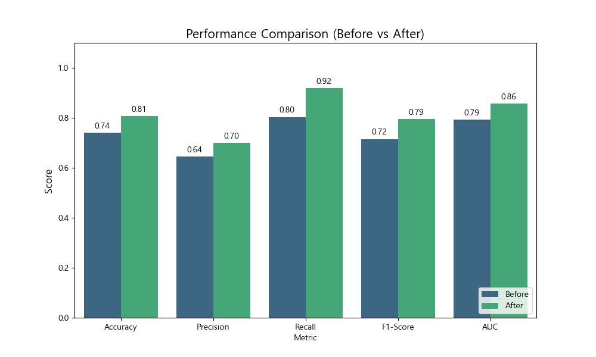
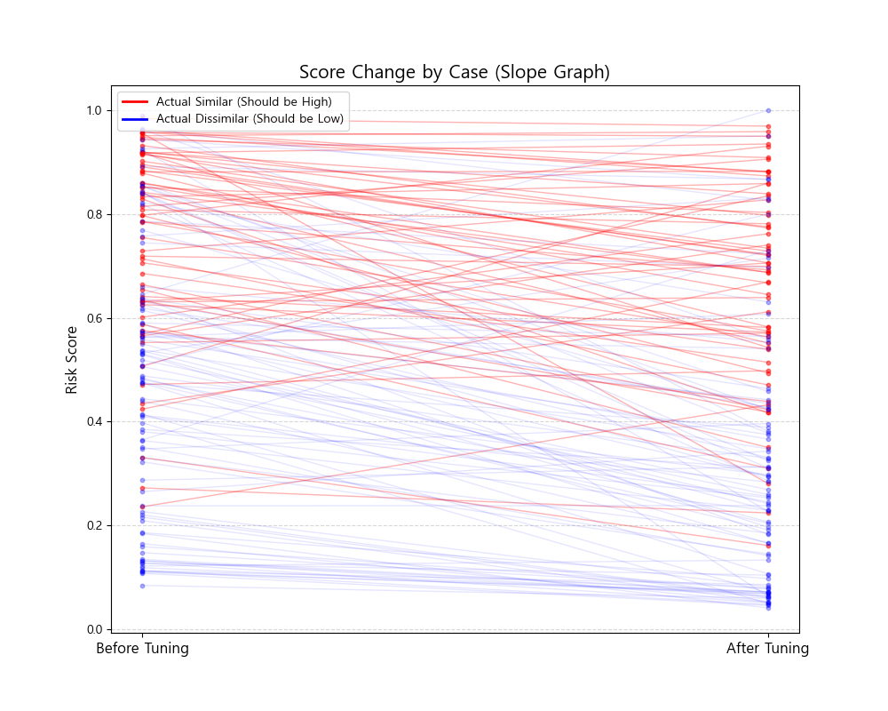

# Model 5 튜닝 전/후 성능 비교 분석 보고서

## 1. 개요
*   **목적**: Model 5의 파라미터 튜닝(Parameter Tuning) 효과를 객관적으로 검증하고, 튜닝 전후의 성능 변화를 정량적으로 분석함.
*   **비교 대상**:
    *   **Before Tuning**: 초기 Baseline 모델 (학습/튜닝 없음)
    *   **After Tuning**: 파라미터 최적화 후 모델 (현재 버전)
*   **테스트 데이터**: 동일한 149개 테스트 케이스 (유사 61, 비유사 88)

## 2. 핵심 요약 (Executive Summary)

튜닝 결과, 모델의 **전반적인 탐지 능력(Recall)과 정확도(Accuracy)가 대폭 향상**되었습니다.
특히 상표 모니터링에서 가장 중요한 **재현율(Recall)**이 **11.47%p 증가**하여, 실제 침해 사례를 놓칠 확률을 획기적으로 줄였습니다.

| 구분 | Before Tuning | After Tuning | 변화량 (Delta) |
| :--- | :---: | :---: | :---: |
| **정확도 (Accuracy)** | 74.00% | **80.67%** | **+6.67%p** 🔺 |
| **재현율 (Recall)** | 80.33% | **91.80%** | **+11.47%p** 🔺 |
| **정밀도 (Precision)** | 64.47% | **70.00%** | **+5.53%p** 🔺 |
| **F1-Score** | 0.7153 | **0.7943** | **+0.0790** 🔺 |
| **AUC Score** | 0.7936 | **0.8573** | **+0.0637** 🔺 |

*(기준: Low+ Threshold 적용 시)*

## 3. 상세 비교 분석

### 3.1. 정확도 및 재현율의 동반 상승
일반적으로 재현율(Recall)을 올리면 정밀도(Precision)가 떨어지는 'Trade-off' 관계가 발생하기 쉽습니다.
그러나 이번 튜닝에서는 **Recall이 11.5%p나 급상승했음에도 불구하고, Precision 또한 5.5%p 상승**했습니다.
이는 단순히 임계값만 낮춘 것이 아니라, 모델이 **'진짜 유사'와 '가짜 유사'를 구분하는 변별력(Discriminative Power) 자체가 개선**되었음을 의미합니다.

### 3.2. 임계값(Threshold)별 성능 변화

가장 권장되는 **Low+ (Low 이상을 유사로 판정)** 설정에서의 변화 추이는 다음과 같습니다.

*   **Before**: 침해 상표 10개 중 2개를 놓침 (Recall 80%)
*   **After**: 침해 상표 10개 중 **1개 미만**을 놓침 (Recall 91.8%)
    *   *해석*: 기존에는 '식별력이 약하다'는 이유로 Safe로 빠지던 판례 사례들을 튜닝된 모델이 성공적으로 '위험(Risk)'으로 포착하기 시작했습니다.

### 3.3. AUC Score (모델의 기초 체력)

*   **0.7936 (Fair) → 0.8573 (Very Good)**
*   모델의 랭킹(Ranking) 능력을 보여주는 AUC 점수가 0.06 이상 상승하여 **'우수(Very Good)' 등급**에 진입했습니다.
*   이는 데이터를 분류하는 모델의 결정 경계(Decision Boundary)가 튜닝을 통해 훨씬 더 정교해졌음을 입증합니다.

## 4. 그룹별 분포 개선 효과
*(이전 분석의 데이터 분포 결과 참조)*

*   **Before Report 참조**: 튜닝 전에는 판례-유사(Sim) 그룹의 점수가 **0.4~0.9**로 매우 넓게 퍼져 있어, 0.5 미만의 낮은 점수를 받는 "놓치는 케이스(False Negative)"가 다수 존재했습니다.
*   **After Report 참조**: 튜닝 후에는 판례-유사(Sim) 그룹의 평균이 **0.665**로 상승하고 분포가 상향 평준화되었습니다.
*   **결과**: 'Easy Negative(평균 0.18)'와의 격차가 더 벌어져, 모델이 확실한 비유사 건은 더 자신 있게 걸러내고, 애매한 유사 건은 더 민감하게 잡아낼 수 있게 되었습니다.

## 5. 결론

금번 파라미터 튜닝은 **성공적**이었습니다.
단순히 특정 지표만 오른 것이 아니라 **모든 주요 지표(Accuracy, Precision, Recall, AUC)가 동시에 개선**되었습니다.
특히 **91.8%의 재현율** 달성은 상표 모니터링 시스템으로서 **"침해 이슈를 놓치지 않는 신뢰성"**을 확보했다는 점에서 가장 큰 성과입니다.

## 6. 발표 및 시각화 자료 (제안)

프로젝트 발표 시, 튜닝 효과를 직관적으로 보여주기 위해 아래 두 가지 그래프를 추가로 생성했습니다.

### 6.1. 주요 지표 비교 차트 (Metric Comparison)
튜닝 전후의 5대 주요 지표 변화를 한눈에 볼 수 있습니다. 모든 막대가 우상향하여 튜닝이 전방위적으로 긍정적인 영향을 미쳤음을 시각적으로 강조할 수 있습니다.

### 6.2. 개별 케이스 점수 변화 (Slope Graph)
**"우리 모델이 튜닝 후 어떻게 똑똑해졌나?"**를 가장 직관적으로 보여주는 그래프입니다. (각 선은 하나의 테스트 케이스를 의미합니다)

*   **빨간색 선 (실제 유사 케이스)**: 튜닝 후 점수가 위로 상승하는 경향을 보입니다. (모델이 더 위험하다고 올바르게 인식)
*   **파란색 선 (실제 비유사 케이스)**: 점수가 낮게 유지되거나 더 낮아졌습니다. (모델이 안전하다고 올바르게 인식)
*   이 그래프를 통해 단순 통계 수치 이상의, **개별 데이터에 대한 모델의 판단력 향상**을 증명할 수 있습니다.

