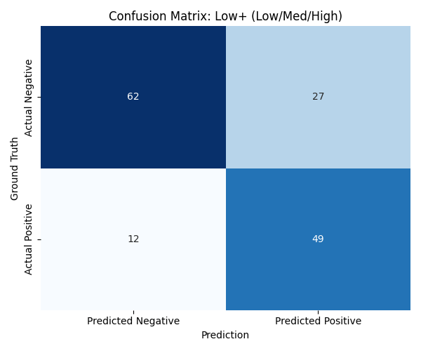
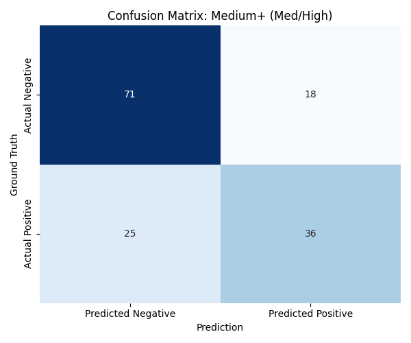
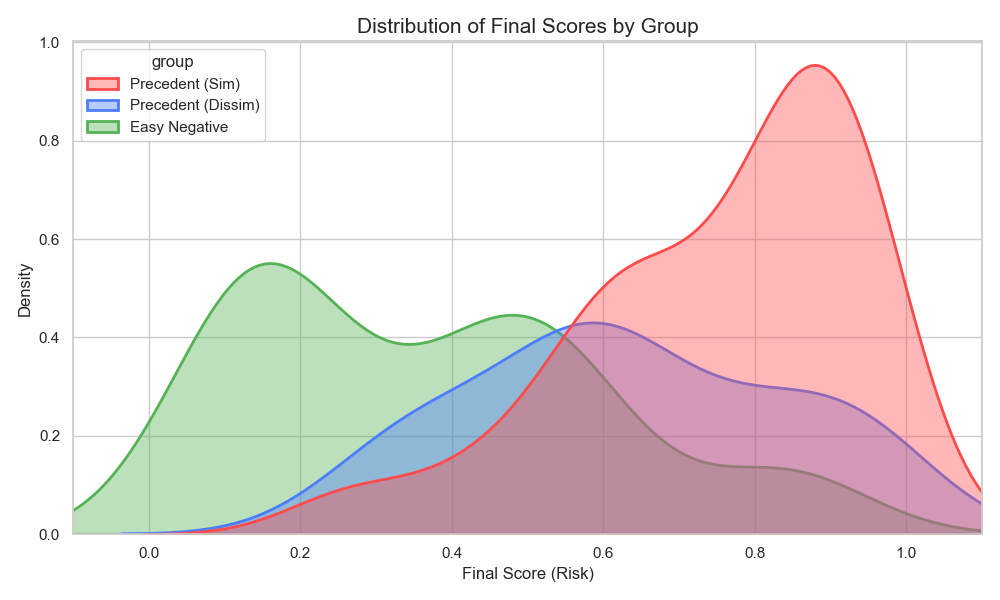
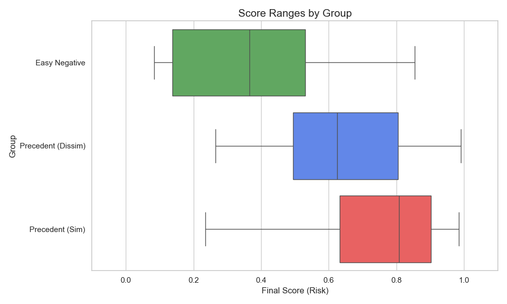
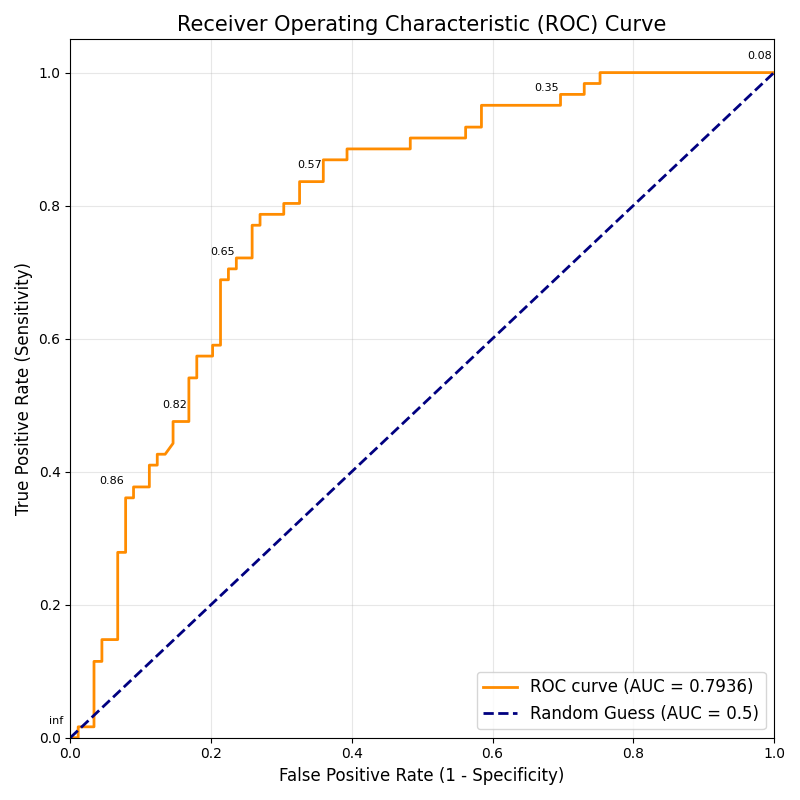

# Model 5 Performance Analysis Report (1st Test, No Training)

> **Date:** 2026-02-18
> **Dataset:** 149 Pairs (Test Set)
> **Model Version:** Model 5 (Ensemble) - Initial Baseline

## 1. Executive Summary

총 149개의 테스트 케이스(유사 61건, 비유사 88건)에 대해 Model 5의 성능을 평가했습니다.
이번 평가는 학습(Fine-tuning) 없이 로직만으로 구성된 **Baseline 모델**의 성능을 확인하는 과정입니다.

### **Key Findings**

- **최고 정확도 (Max Accuracy):** **74.0%** (기준: Low 등급 이상을 '유사'로 판단 시)
- **안전성 (Max Recall):** **80.3%** (실제 침해 사례 10개 중 8개를 탐지)
- **주요 약점:** "식별력이 약하다"고 판단되는 **간단한 표장(문자열)**에 대해 과도한 페널티를 부여하여, 명백히 유사함에도 불구하고 `Safe`로 판정하는 **보수적 경향**이 발견됨.

---

## 2. Performance Metrics by Threshold

모델이 예측한 `Risk Level`을 어디까지 '유사(Danger)'로 볼 것인가에 따라 성능이 달라집니다.

현재 기준 safe: 0~ 0.6, low : 0.6~0.75, medium : 0.75~ 0.9, high: 0.9~1.0

| Threshold Criteria      |  Accuracy  | Precision  |   Recall   |  F1 Score  | 비고                          |
| :---------------------- | :--------: | :--------: | :--------: | :--------: | :---------------------------- |
| **Low+ (Low/Med/High)** | **0.7400** |   0.6447   | **0.8033** | **0.7153** | **(추천)** 탐지율 최우선 설정 |
| **Medium+ (Med/High)**  |   0.7133   |   0.6667   |   0.5902   |   0.6261   | 정밀도/재현율 균형            |
| **High+ (High Only)**   |   0.6600   | **0.7273** |   0.2623   |   0.3855   | 확실한 건만 탐지 (보수적)     |

### **Confusion Matrices**

_(이미지 파일은 리포트와 동일한 폴더에 저장되었습니다.)_

#### 1) Low+ Criteria (추천)

- **설명:** Risk Level이 `Low`, `Medium`, `High`인 경우를 모두 '유사'로 예측.
- **분석:** 실제 유사 케이스 61건 중 **49건을 탐지(TP)**하고, 12건을 놓침(FN). 초기 스크리닝 도구로 적합함.

#### 2) Medium+ Criteria

- **설명:** Risk Level이 `Medium`, `High`인 경우만 '유사'로 예측.
- **분석:** 놓치는 케이스(FN)가 25건으로 급증함. 현 단계에서는 사용을 권장하지 않음.

---

## 3. 심층 분석: 왜 틀렸는가? (Error Analysis)

### 3.1. False Negatives (유사한데 '비유사'로 판정한 경우)

가장 치명적인 오류 유형입니다. 주로 **"식별력 미약(Weak Distinctiveness)"** 로직이 너무 강력하게 작동한 것이 원인으로 보입니다.

**대표 실패 사례:**
| Case ID | Target | Cited | Model Prediction | 원인 분석 |
|---|---|---|---|---|
| **2022허2691** | DB | DB | Safe (0.42) | 문자 'DB'를 '간단하고 흔한 표장'으로 보아 식별력을 거의 0으로 만듦. 둘 다 'DB'로 똑같음에도 불구하고 "식별력이 없으므로 유사하지 않다"는 논리에 빠짐. |
| **2022허4581** | Fermeal | per meal | Safe (0.43) | 'Fermeal'의 의미를 분석하다가 식별력을 낮게 평가(Grade 3)하고, 전체 관찰(Weighted RMS)로 넘어가면서 점수가 희석됨. |
| **2014허4630** | NOEL | NOEL | Safe (0.51) | 'NOEL'이 성질표시(성탄절)에 해당하여 식별력이 없다고 판단. 문자열이 100% 일치함에도 불구하고 법리적 이유로 점수를 대폭 깎음. |

**💡 Insight:**
현재 알고리즘(Node 6)은 **"식별력이 낮은 부분은 유사해도 무시한다"**는 상표법의 대원칙을 따르고 있습니다. 그러나 100% 일치하거나 매우 유사한 경우에는 이 원칙을 예외적으로 완화해야 할 필요가 있습니다. (예: 문자열 완전 일치 시 가산점 부여)

### 3.2. False Positives (비유사한데 '유사'로 판정한 경우)

**대표 오탐 사례:**
| Case ID | Target | Result | Model Prediction | 원인 분석 |
|---|---|---|---|---|
| **2020허3751** | Poi AROMA | 비유사 | Medium (0.84) | 'AROMA' 부분이 성질표시임에도 불구하고, 호칭(Phonetic) 유사도가 높게 나와 전체 점수를 견인함. |

---

## 4. 향후 개선 방향 (Recommendations)

1.  **"완전 일치" 가산점 로직 추가 (Rule-based Override):**
    - Target Text와 Cited Text가 문자 그대로 **완전히 일치**하거나, **포함(Inclusion)** 관계일 경우, 식별력이 낮더라도 `Risk Level`을 강제로 상향 조정해야 합니다. (DB vs DB 케이스 해결용)
2.  **Calibrator (Node 0) 임계값 조정:**
    - 현재 Model 2(Visual)의 점수가 전반적으로 낮게 나오고 있습니다. 외관 유사도의 반영 비율을 높이거나 Calibration 곡선을 완만하게 수정할 필요가 있습니다.
3.  **Low 등급의 활용:**
    - 현재 모델 성능상 `Low` 등급이 실제로는 '유사'일 확률이 꽤 높습니다. 사용자에게 리포팅할 때 `Low` 등급도 "유사 가능성 있음(주의)" 정도로 노출하는 것이 안전합니다.

---

## 5. 데이터 상세 분포 (Data Distribution Analysis)

Model 5가 산출한 **최종 위험도 점수(Final Score)**가 실제 그룹별로 어떻게 분포하는지 시각화했습니다.

### **5.1. 그룹별 점수 분포 (KDE Plot)**

- **Easy Negative (초록색):** 0.1~0.4 구간에 집중되어 있어, 명백한 비유사 사례는 확실하게 걸러내고 있습니다.
- **판례-유사 (빨간색) vs 판례-비유사 (파란색):** 두 그룹의 분포가 0.6~0.9 구간에서 상당히 겹쳐 있습니다(Overlapping). 이는 모델이 **'유사'와 '비유사'의 경계를 명확히 구분하지 못하고 있음**을 시사합니다.

### **5.2. 그룹별 점수 범위 (Box Plot)**

| Group | Mean Score | Median | Max |
| :--- | :---: | :---: | :---: |
| **Easy Negative** | 0.37 | 0.35 | 0.85 |
| **Precedent (Dissim)** | 0.64 | 0.65 | 0.99 |
| **Precedent (Sim)** | 0.75 | 0.78 | 0.98 |

- **Precedent (Dissim)** 그룹의 평균 점수(0.64)가 꽤 높게 형성되어 있어, False Positive(오탐) 가능성이 존재합니다.
- **Precedent (Sim)** 그룹의 점수폭이 넓게 퍼져 있어(0.4~0.9), 일부 식별력이 낮은 유사 사례들이 낮은 점수를 받고 있음을 재확인할 수 있습니다.

---

## 6. ROC Curve & AUC 분석 (Model Potential Analysis)

### **6.1. ROC Curve란? (Educational Context)**
- **정의:** FP(False Positive, 오탐) 비율이 늘어날 때, TP(True Positive, 정탐) 비율이 얼마나 빠르게 늘어나는지를 그린 곡선입니다.
- **해석 방법:**
    - 그래프가 **왼쪽 위 모서리(Left-Top)**에 가까울수록 이상적인 모델입니다. (오탐 없이 정답을 맞춤)
    - **빨간 대각선(점선)**은 "동전 던지기(무작위 추측)" 수준의 성능을 의미합니다.

### **6.2. 분석 결과 (AUC Score: 0.7936)**

- **AUC (Area Under Curve) 점수:** **0.7936**
    - **의미:** 모델이 임의의 '유사' 케이스와 '비유사' 케이스를 골랐을 때, '유사' 케이스에 더 높은 점수를 부여할 확률이 약 **79.36%**라는 뜻입니다.
    - **평가:**
        - `0.5 ~ 0.6`: Fail (사용 불가)
        - `0.6 ~ 0.7`: Poor (개선 필요)
        - `0.7 ~ 0.8`: **Fair (준수함, 현재 수준)**
        - `0.8 ~ 0.9`: Good (우수함)
        - `0.9 ~ 1.0`: Excellent (매우 우수함)

> **Conclusion:** 현재 모델은 학습 없이도 **"준수한(Fair)" 수준의 변별력**을 갖추고 있습니다. 향후 Fine-tuning을 통해 AUC를 **0.9 이상**으로 끌어올리는 것을 목표로 해야 합니다.
